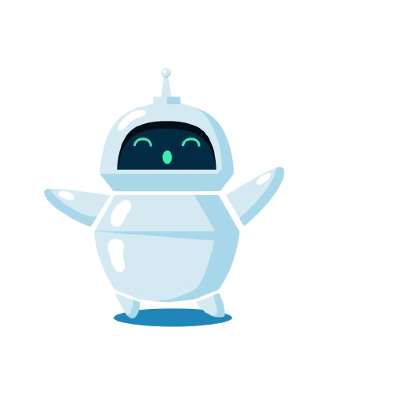

# Medusas issue bot

Hey, folks!

This is a [Next.js](https://nextjs.org/) project bootstrapped with [`create-next-app`](https://github.com/vercel/next.js/tree/canary/packages/create-next-app).

## Setup

1. Create an OPEN AI KEY from [here](https://platform.openai.com/)
2. Copy `env.dist` to `.env`
3. Copy the API KEY and the ORGANIZATION ID from first step
4. Install dependencies `npm ci`
5. Run `npm run dev` for development proposes

Open [http://localhost:3000](http://localhost:3000) with your browser to see the result and enjoy the magic experience!
